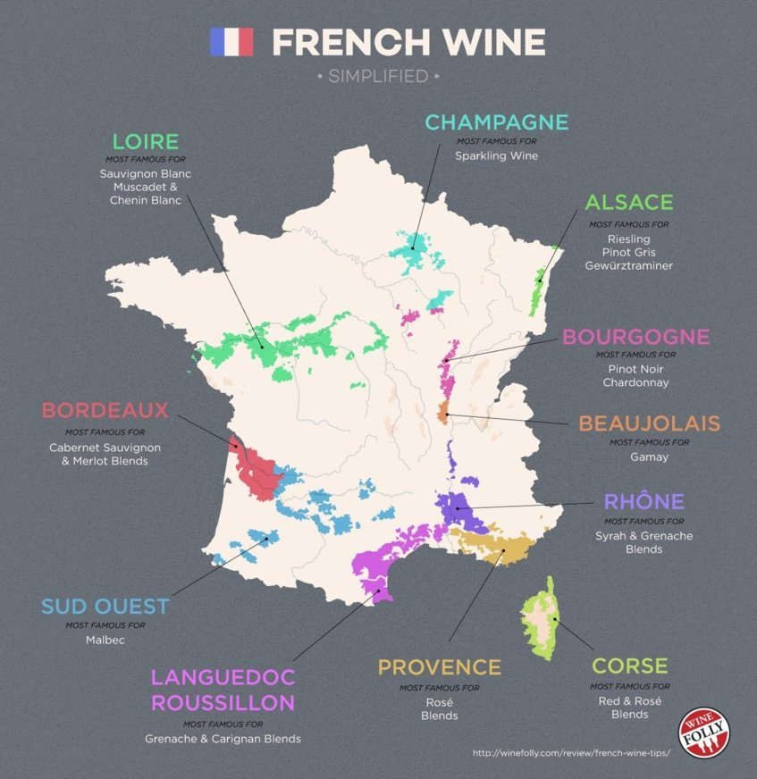

https://www.vivino.com/wine-regions/bourgogne
# France

## The Northeast
### Champagne
### Alsace
### bourgogne 358

## The South East
### Rhone Valley
### Savoie
### Provence

## Southwestern France
### Languedoc-Roussillon 536
### The South-West Le Sud-Ouest
### Bordeaux 383
#### Medoc = 417
https://www.vivino.com/wine-regions/medoc
* Haut-Médoc = 1602 wines = 427
* Margaux =  = 384
* Saint-Estèphe = 700 wines
* Pauillac = 593 wines
* Saint-Julien = 397 wines
* Moulis-en-Médoc = 222 wines
* Listrac-Médoc = 219 wines
### Graves = 451
* Pessac-Léognan = 471
* Graves Supérieures = 2455
* Cérons = 2145
### Libournais = 509
* Saint Emilion = 436
** Saint Emilion Grand Cru = 827
Lalande  De Pomerol = 386

## Western France
### Cognac
### Loire Valley 729

